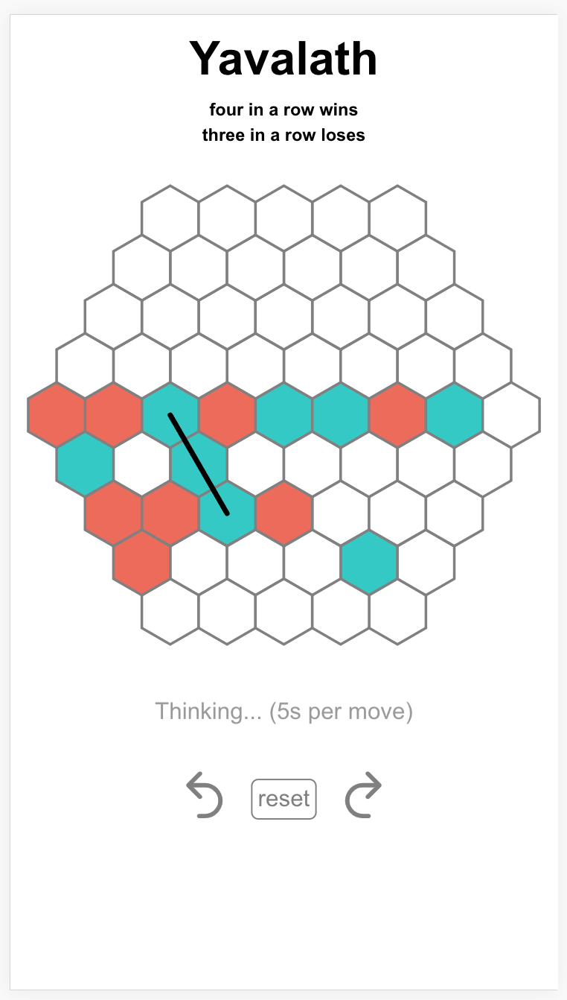

# Yavalath

**A small AI/UI for a fun game**

Uses rust, webassembly, service workers to run in the browser. Ai is MCTS, it's pretty weak. Unfortunately there's a bug in `parcel build` that means there's no live demo rn.

* `npm run start` -- Serve the project locally for
  development at `http://localhost:1234`.

* `npm run build` -- Bundle the project (in production mode)
